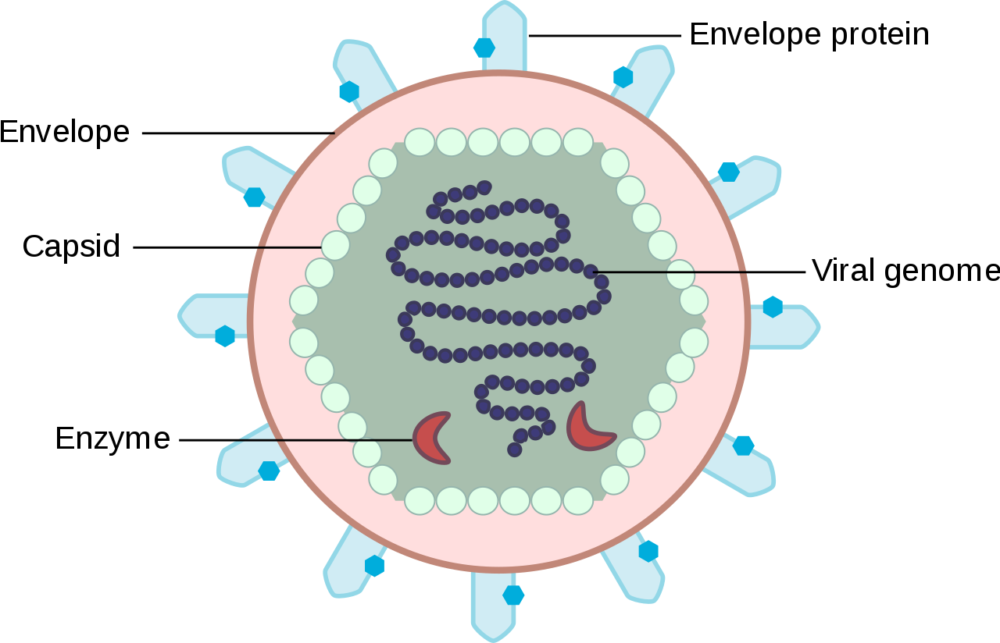

# Coronavirus Disease (COVID-19)

### To better understand what is Coronavirus (COVID-19), why is it spreading exponentially, why is it hard to combat, we would need to know what is a Virus, its structure and how it spreads.

### What is a VIRUS?

A virus is a biological agent that reproduces inside the cells of living hosts. When infected by a virus, a host cell is forced to quickly produce thousands of identical copies of the original virus. Unlike most living things, viruses do not have cells that divide; new viruses are assembled in the infected host cell. But unlike still simpler infectious agents like prions, viruses contain genes, which gives them the ability to mutate and evolve. Over 4,800 species of viruses have been discovered.

## VIRUS's structure

A virus consists of two or three parts: genes, made from either DNA or RNA, long molecules that carry genetic information; a protein coat that protects the genes; and in some viruses, an envelope of fat that surrounds the protein coat (which makes them vulnerable to soap) and is used, in combination with specific receptors, to enter a new host cell. 
Viruses vary in shape from the simple helical and icosahedral to more complex structures. Viruses range in size from 20 to 300 nanometres; it would take 33,000 to 500,000 of them, side by side, to stretch to 1 centimetre (0.39 in).

## How Viruses Spread?

Viruses spread in many different ways. Just as many viruses are very specific as to which host species or tissue they attack, each species of virus relies on a particular method for propagation. Plant viruses are often spread from plant to plant by insects and other organisms, known as vectors. Some viruses of humans and other animals are spread by exposure to infected bodily fluids.
Viruses, particularly those that have RNA, can mutate rapidly and give rise to new types of viruses against which their hosts have little protection. Influenza virus, for example, changes often, which is why a new vaccine is needed each year.
Major changes can cause pandemics as was the case in 2009 when swine influenza spread to most countries. Often these mutations take place when the virus has infected other animals such as bats in the case of coronavirus, and pigs and birds in influenza, before spreading to humans

## Ater we have defined what is a Virus, its structure and how it spreads, now we can define Coronavirus (COVID-19), its structure and how it spreads as a kind of virus

## What is a Coronavirus?

Coronaviruses are a large family of viruses which may cause illness in animals or humans.  In humans, several coronaviruses are known to cause respiratory infections ranging from the common cold to more severe diseases such as Middle East Respiratory Syndrome (MERS) and Severe Acute Respiratory Syndrome (SARS). The most recently discovered coronavirus causes Coronavirus disease COVID-19.

## What is COVID-19.

COVID-19 is the infectious disease caused by the most recently discovered coronavirus. This new virus and disease were unknown before the outbreak began in Wuhan, China, in December 2019.

## How does COVID-19 spread?

People can catch COVID-19 from others who have the virus. The disease can spread from person to person through small droplets from the nose or mouth which are spread when a person with COVID-19 coughs or exhales. These droplets land on objects and surfaces around the person. Other people then catch COVID-19 by touching these objects or surfaces, then touching their eyes, nose or mouth. People can also catch COVID-19 if they breathe in droplets from a person with COVID-19 who coughs out or exhales droplets. This is why it is important to stay more than 1 meter (3 feet) away from a person who is sick.
